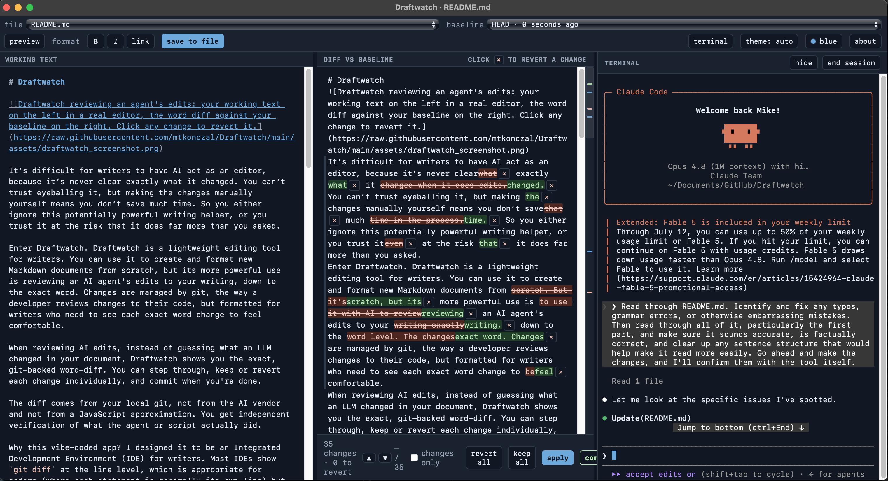

::: {.mk-page-narrow}

**Review an AI's edits to your writing the way you'd review a pull request.**

```{=html}
<p class="mk-btn-row">
  <a class="mk-btn" href="https://github.com/mtkonczal/Draftwatch" target="_blank" rel="noopener">View on GitHub</a>
  <a class="mk-btn mk-btn--ghost" href="#install">Install</a>
</p>
```

{.mk-dw-shot}

::: {.mk-readme}

:::

```{=html}
<p class="mk-readme__source">This section is the project <a href="https://github.com/mtkonczal/Draftwatch#readme">README</a>, synced from GitHub — run <code>scripts/sync-draftwatch-readme.sh</code> to refresh it.</p>
```

:::
