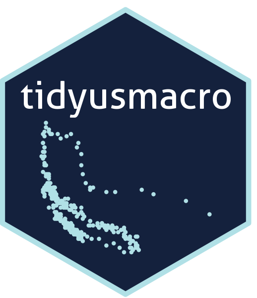

::: {#top .mk-hero}


::: {.mk-hero__bio}
Mike Konczal is the Vice-President of Policy and Research at the [Economic Security Project](https://www.economicsecurityproject.org/), where he oversees policy development, research, and strategic analysis to build economic power for all Americans. Previously, he served as a Special Assistant to the President for Economic Policy and Chief Economist at the National Economic Council.

A former software and financial engineer, he was an early hire at the Roosevelt Institute, where he led major projects on financial reform, inequality, economic ideas, and macroeconomics. He is the author of [*Freedom from the Market*](#book) (New Press, 2021), described by the *Financial Times* as "a powerful polemic," and co-author of [*Rewriting the Rules of the American Economy*](https://wwnorton.com/books/rewriting-the-rules-of-the-american-economy/) (W.W. Norton, 2015) with Joseph Stiglitz. He holds a B.A. in math and computer science and an M.S. in finance from the University of Illinois at Urbana-Champaign.

Specializing in economic data analysis and policy research, Mike is a respected voice in U.S. economic discourse, frequently cited in media outlets, and has provided testimony before Congress. The *New York Times Magazine* has described him as having "a cult following among progressives." Born and raised in Chicago, he now lives in Takoma Park, Maryland, with his wife, two daughters, and pit bull.
:::
:::

## Latest {#latest}

A running shortlist of my most recent work.

```{r recent_work, echo=FALSE, message=FALSE, warning=FALSE}
library(tidyverse)
library(lubridate)
library(htmltools)

fix_title_case <- function(x) {
  x <- str_to_title(x)
  for (w in c(" A "," An "," The "," And "," But "," For "," Of "," In "," On "," To "," With ")) {
    x <- str_replace_all(x, w, str_to_lower(w))
  }
  # strip stray smart-quote bytes that snuck into the CSV
  x <- str_remove_all(x, "[\u00d4\u00d5]")
  x
}

recent <- read_csv("data/mywork.csv", show_col_types = FALSE) %>%
  mutate(
    Title = fix_title_case(`Original Title`),
    Date  = as.Date(Date),  # ISO YYYY-MM-DD in the CSV
    Type  = str_replace_all(Format, "White Paper", "Research")
  ) %>%
  filter(Highlight == "X") %>%
  arrange(desc(Date)) %>%
  head(5)

items <- pmap(recent, function(Date, Title, Outlet, Type, Link, ...) {
  tags$a(
    class = "mk-recent__item",
    href  = Link,
    target = "_blank",
    rel = "noopener",
    tags$div(class = "mk-recent__date",
             format(Date, "%b %d, %Y")),
    tags$div(class = "mk-recent__body",
             tags$div(class = "mk-recent__title", Title),
             tags$div(class = "mk-recent__meta",
                      tags$span(class = "mk-recent__outlet", Outlet))),
    tags$div(class = "mk-recent__type", Type)
  )
})

# Make the whole row a link by switching the wrapper element
htmltools::tagList(
  tags$div(class = "mk-recent", !!!items)
)
```

## Portfolio {#portfolio}

A combined record of my work: writing, research, media appearances, and press hits. Use the tabs to switch between them, or search within any category. Feel free to contact me if you'd like me to write for you or join you on air.

```{r setup, message=FALSE, warning=FALSE}
library(tidyverse)
library(lubridate)
library(DT)
library(htmltools)

fix_title_case <- function(x) {
  x <- str_to_title(x)
  for (w in c(" A "," An "," The "," And "," But "," For "," Of "," In "," On "," To "," With ")) {
    x <- str_replace_all(x, w, str_to_lower(w))
  }
  str_remove_all(x, "[ÔÕ]")
}

raw <- read_csv("data/mywork.csv", show_col_types = FALSE) %>%
  mutate(
    Title = fix_title_case(`Original Title`),
    Date  = as.Date(Date)  # ISO YYYY-MM-DD in the CSV
  ) %>%
  arrange(desc(Date))

# Map each Format to a top-level tab. To add a tab later, extend this mapping
# and add a matching <button> in the `tabs` chunk below.
cat_for <- function(format) {
  case_when(
    format %in% c("Article", "Book Review")          ~ "Writing",
    format == "White Paper"                          ~ "Research",
    format %in% c("TV", "Radio", "Podcast", "Panel") ~ "Media",
    format == "Quote"                                ~ "Press",
    TRUE                                             ~ NA_character_
  )
}

# Label shown in the Type pill (distinct from the tab/Category above).
type_label <- function(format) {
  case_when(
    format == "White Paper" ~ "Research",
    format == "Quote"       ~ "Press",
    TRUE                    ~ format
  )
}

combined <- raw %>%
  mutate(
    Category = cat_for(Format),
    TypeLab  = type_label(Format)
  ) %>%
  filter(!is.na(Category)) %>%
  mutate(
    Year      = year(Date),
    Month     = format(Date, "%b"),
    TitleHTML = paste0(
      '<a href="', Link, '" target="_blank" rel="noopener">', Title, '</a>',
      '<span class="mk-outlet">', Outlet, '</span>'
    ),
    TypeHTML  = paste0('<span class="mk-pill" data-type="', TypeLab, '">', TypeLab, '</span>')
  ) %>%
  select(Category, Year, Month, Type = TypeHTML, Title = TitleHTML)

# Counts per tab, in display order.
tab_n      <- function(cat) sum(combined$Category == cat)
n_writing  <- tab_n("Writing")
n_research <- tab_n("Research")
n_media    <- tab_n("Media")
n_press    <- tab_n("Press")
```

```{r tabs, results='asis'}
cat(sprintf('
<div id="mk-portfolio-tabs" class="mk-tabs" role="tablist" aria-label="Filter portfolio by type">
  <button type="button" class="mk-tab is-active" role="tab" data-cat="Writing" aria-selected="true">Writing<span class="mk-tab__count">%d</span></button>
  <button type="button" class="mk-tab" role="tab" data-cat="Research" aria-selected="false">Research<span class="mk-tab__count">%d</span></button>
  <button type="button" class="mk-tab" role="tab" data-cat="Media" aria-selected="false">Media<span class="mk-tab__count">%d</span></button>
  <button type="button" class="mk-tab" role="tab" data-cat="Press" aria-selected="false">Press<span class="mk-tab__count">%d</span></button>
</div>
', n_writing, n_research, n_media, n_press))
```

::: {.mk-table}

```{r portfolio_table, message=FALSE, warning=FALSE}
datatable(
  combined,
  rownames = FALSE,
  escape   = FALSE,
  class    = "row-border compact",
  callback = JS("
    var labels = { Writing: 'Search writing…', Research: 'Search research…', Media: 'Search media…', Press: 'Search press…' };
    var box = $(table.table().container()).find('input[type=search]');
    function activate(cat) {
      $('#mk-portfolio-tabs .mk-tab').each(function() {
        var on = this.getAttribute('data-cat') === cat;
        this.classList.toggle('is-active', on);
        this.setAttribute('aria-selected', on ? 'true' : 'false');
      });
      box.attr('placeholder', labels[cat] || '');
      table.column(0).search(cat).draw();
    }
    $('#mk-portfolio-tabs .mk-tab').on('click', function() {
      activate(this.getAttribute('data-cat'));
    });
    activate('Writing');
  "),
  options  = list(
    pageLength   = 5,
    lengthMenu   = c(5, 10, 25, 50, 100),
    dom          = "<'top'fl>rt<'bottom'ip>",
    autoWidth    = FALSE,
    order        = list(list(1, 'desc')),
    columnDefs   = list(
      list(targets = 0, visible = FALSE, searchable = TRUE),
      list(targets = 1, className = "mk-col-year"),
      list(targets = 2, className = "mk-col-month"),
      list(targets = 3, className = "mk-col-type", orderable = FALSE),
      list(targets = 4, className = "mk-col-title")
    ),
    language = list(
      search       = "",
      searchPlaceholder = "Search writing…",
      lengthMenu   = "Show _MENU_",
      info         = "_START_–_END_ of _TOTAL_",
      infoEmpty    = "No results",
      infoFiltered = "(filtered from _MAX_)",
      paginate     = list(previous = "‹ Prev", `next` = "Next ›")
    )
  )
)
```

:::

You can [check out my resume here](resume.html).

## Projects {#projects}

Open-source tools I build and maintain, for economic data analysis and for writing.

```{=html}
<div class="mk-projects">
  <a class="mk-project" href="tidyusmacro.html">
    <div class="mk-project__media mk-project__media--hex">
      
    </div>
    <div class="mk-project__body">
      <div class="mk-project__title">tidyusmacro</div>
      <p class="mk-project__desc">An R package that downloads and tidies U.S. macroeconomic data from BLS, BEA, and FRED flat files, returning consistent data frames ready for modeling and graphics seconds after a release goes live.</p>
      <span class="mk-project__cta">Package site &amp; function reference</span>
    </div>
  </a>
  <a class="mk-project" href="draftwatch.html">
    <div class="mk-project__media">
      
    </div>
    <div class="mk-project__body">
      <div class="mk-project__title">Draftwatch</div>
      <p class="mk-project__desc">A lightweight IDE for writers to review an AI agent's edits like a pull request: the exact git-backed word diff of what changed, with each change kept or reverted at a click.</p>
      <span class="mk-project__cta">About Draftwatch</span>
    </div>
  </a>
</div>
```

## Freedom from the Market {#book}

::: {.mk-book}


::: {.mk-book__praise}
### Praise for *Freedom from the Market*

"Konczal is one of the warriors in this fight, arguing fiercely for the need to set much narrower limits on what is left to markets than has been the case in recent decades. A powerful polemic."\
--- Martin Wolf, [*Financial Times*](https://www.ft.com/content/239f31cb-57a3-43d3-ab3d-d18d068f4994)

"By identifying an alternative grammar, one that is grounded in the American past, Freedom from the Market provides a way out of the political cul-de-sac created by the failure of the market to deliver on its promises of 'freedom.'"\
--- Molly Michelmore, [*Democracy: A Journal of Ideas*](https://democracyjournal.org/magazine/61/freedoms-just-another-word/)

"Freedom from the Market is an impressive book, easily one of the best I've read in the past several years. I cannot recommend it highly enough."\
--- Matt Mazewski, [*Commonweal*](https://www.commonwealmagazine.org/polanyi-ish)

"terrific book."\
--- Jamelle Bouie, [*New York Times*](https://twitter.com/jbouie/status/1450470921001750528)
:::
:::

::: {.column width="49%"}
### Reviews

[Commonweal](https://www.commonwealmagazine.org/polanyi-ish) ·
[Liberal Currents](https://www.liberalcurrents.com/freedom-and-the-common-good-mike-konczals-emfreedom-from-the-market-em/) ·
[Democracy Journal](https://democracyjournal.org/magazine/61/freedoms-just-another-word/) ·
[Financial Times](https://www.ft.com/content/239f31cb-57a3-43d3-ab3d-d18d068f4994) ·
[Foreign Affairs](https://www.foreignaffairs.com/reviews/review-essay/2021-02-16/market-value) ·
[Foreign Policy](https://foreignpolicy.com/2021/02/06/social-welfare-is-as-american-as-apple-pie/) ·
[Los Angeles Review of Books](https://lareviewofbooks.org/article/resisting-market-rule/) ·
[Wall Street Journal](https://www.wsj.com/articles/politics-of-markets-and-morals-11611961820) ·
[The Week](https://theweek.com/articles/963196/america-forgotten-how-free) ·
[Crooked Timber](https://crookedtimber.org/2021/01/26/freedom-from-the-market/) ·
[Karl Polanyi Project](https://karlpolanyiproject.blogspot.com/2021/01/polanyi-goes-to-america.html) ·
[National Review](https://www.nationalreview.com/2021/01/americas-supposedly-socialist-history/)
:::

::: {.column width="49%"}
### Media Appearances

[Majority Report](https://majorityreportradio.com/2021/01/27/1-27-americas-fight-to-liberate-itself-from-the-grip-of-the-market-w-mike-konczal) ([YouTube](https://www.youtube.com/watch?v=6i9XRNUNx8c)) ·
[Left Anchor](https://leftanchor.podbean.com/e/episode-175-americas-tradition-of-egalitarian-freedom-with-mike-konczal/) ·
[Vox's The Weeds](https://www.stitcher.com/show/voxs-the-weeds/episode/freedom-from-markets-81017167) ·
[Mass for Shut-Ins](https://massforshutins.libsyn.com/030-mike-konczal-freedom-from-the-market-2021) ·
[Lawyers, Guns and Money](https://www.lawyersgunsmoneyblog.com/2021/01/lgm-podcast-market) ·
[Dissent](https://www.dissentmagazine.org/online_articles/life-beyond-markets-mike-konczal)

### Excerpts and other Resources

[Medicare and desegregation at The Nation](https://www.thenation.com/article/politics/health-care-freedom-medicare/) ·
[Eight-hour workday at Boston Review](http://bostonreview.net/class-inequality-law-justice/mike-konczal-time-universal-measure-freedom)
:::

<!-- ==========================================================================
     NOW  —  the prose for each update lives in _now-entries.qmd (newest first).
     To post a new update, edit THAT file, not this one. The arrows below page
     back and forth through the entries; the "Updated <month>" label and the
     arrow states update automatically from each entry's data-date.
     ========================================================================== -->

## Now {#now}

A snapshot of what I'm working on, reading, and thinking about right now.

::::: {.mk-now role="group" aria-label="Browse Now updates"}

```{=html}
<button type="button" class="mk-now-arrow mk-now-arrow--left" data-now-newer aria-label="Show newer update">&#10094;</button>
```

:::: {.mk-now-viewport}

```{=html}
<a class="mk-now-meta mk-now-permalink" data-now-label href="now.html" aria-live="polite" title="Open this update on its own page">Updated</a>
```



::::

```{=html}
<button type="button" class="mk-now-arrow mk-now-arrow--right" data-now-older aria-label="Show older update">&#10095;</button>
```

:::::

```{=html}
<script>
(function () {
  var root = document.getElementById("now");
  if (!root) return;
  var entries = Array.prototype.slice.call(root.querySelectorAll(".mk-now-entry"));
  if (!entries.length) return;
  // Newest first, by each entry's data-date ("YYYY-MM").
  entries.sort(function (a, b) {
    return (b.getAttribute("data-date") || "").localeCompare(a.getAttribute("data-date") || "");
  });
  var label = root.querySelector("[data-now-label]");
  var older = root.querySelector("[data-now-older]"); // right arrow: back in time
  var newer = root.querySelector("[data-now-newer]"); // left arrow: forward in time
  var months = ["January","February","March","April","May","June","July","August",
                "September","October","November","December"];
  var i = 0; // 0 = newest
  function fmt(d) {
    var p = (d || "").split("-");
    return "Updated " + (months[parseInt(p[1], 10) - 1] || "") + " " + (p[0] || "");
  }
  function render() {
    entries.forEach(function (el, idx) { el.hidden = idx !== i; });
    var d = entries[i].getAttribute("data-date");
    if (label) {
      label.textContent = fmt(d);                        // permalink to the standalone page
      label.setAttribute("href", "now.html#now-" + d);
    }
    if (older) older.disabled = i >= entries.length - 1; // nothing older
    if (newer) newer.disabled = i <= 0;                  // nothing newer
  }
  if (older) older.addEventListener("click", function () { if (i < entries.length - 1) { i++; render(); } });
  if (newer) newer.addEventListener("click", function () { if (i > 0) { i--; render(); } });
  render();
})();
</script>
```
